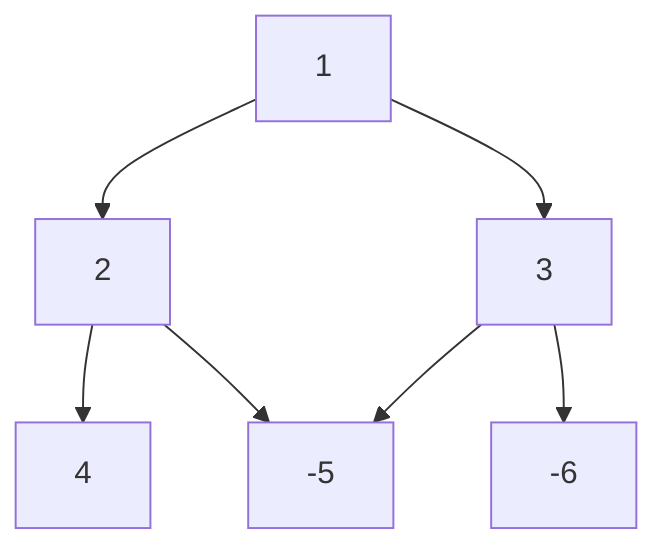

# numerical-triangle
Тестовое задание компании Nedra.
## Условие задания
Имеется треугольник, составленный из чисел. Одно число расположено в вершине. 
Ниже размещено два числа, затем три, и так до нижней грани. Начиная с вершины нужно 
спуститься к основанию треугольника. За каждый ход можно спуститься на один уровень и 
выбрать между двумя числами под текущей позицией. По ходу движения «собираются» и 
суммируются числа, которые проходит алгоритм. Цель — найти максимальную сумму, 
которую можно получить из различных маршрутов.
## Демонстрация
### Пример треугольника

### Работа алгоритма
```console
nedrech@server:~$ dotnet run
Enter the height of the triangle (number of levels): 3
Enter the level numbers each on a new line, separated by a space.
Example (comma for fractional numbers):
1,25
1 2
1 2,2 3
[1/3]: 1
[2/3]: 2 3
[3/3]: 4 -5 -6
Max sum: 7.
Would you like to introduce another example? (y/[n])
```
